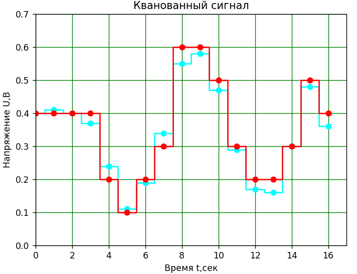

# Инструкция для работы с Markdown 

## Выделение текста

Чтобы выделить тект курсивом необходимо обрамить его звёздочками (*) или знаком нижнего подчеркивания (_). Например, *вот так* или _вот так_.

Чтобы выделить текст полужирным необходимо обрамить его 2-ми завозочками (**) или 2-мя знаками нижнего подчеркивания (__). Например, **вот так** или __вот так__.

Альтернативные способы выделения текста нужны для того, чтобы комбинировать эти 2 способа. Например, _текст может быть выделен курсивом и при этом быть **полужирным**_

## Списки

Чтобы добавить ненумерованные списки, необхдимо пункты выделить звёздочкой (*) или плюсом (+). Например, вот так:
* Элемент 1
* Элемент 2
* Элемент 3
+ Элемент 4

Чтобы добавить нумерованные списки, необходимо пронумеровать пункт. Нпример, вот так:
1. Элемент 1
2. Элемент 2
3. Эдемент 3

## Работа с изображниями

Чтобы встаить изображение в текст, достаточно написать следующее:

## Ссылки

ЧТобы добавить ссылку, необходимо текст ссылку обромить квадратными скобочками ([]), а саму ссылку обромить круглыми скобками (()). При необходимости можно добавить всплывающую подсказку, дописав внути скобок к ссылек текст подсказки в кавычках серез пробел. 

Например, [вот так](www.example.com "пример всплывающей подсказки").

## Работа с таблицами

Для добавления таблицы в текст необходимо написать содержание ячеек и ограничить их знаками палок (|) и знаков минус (-):

Например | вот | так
--- | --- | ---|
1 | 2 | 3

## Цитаты

 Чтобы задать цитату 1-го уровня, нужно поставить перед цитатой знак больше (>). Чтобы задать цитату 2-го уровня, нужно поставить 2 знака больше (>>).

 > Например,
 >> Вот так.

## Заключение

Таким образом мы написали инструкцию к некоторым элементам языка Markdown.